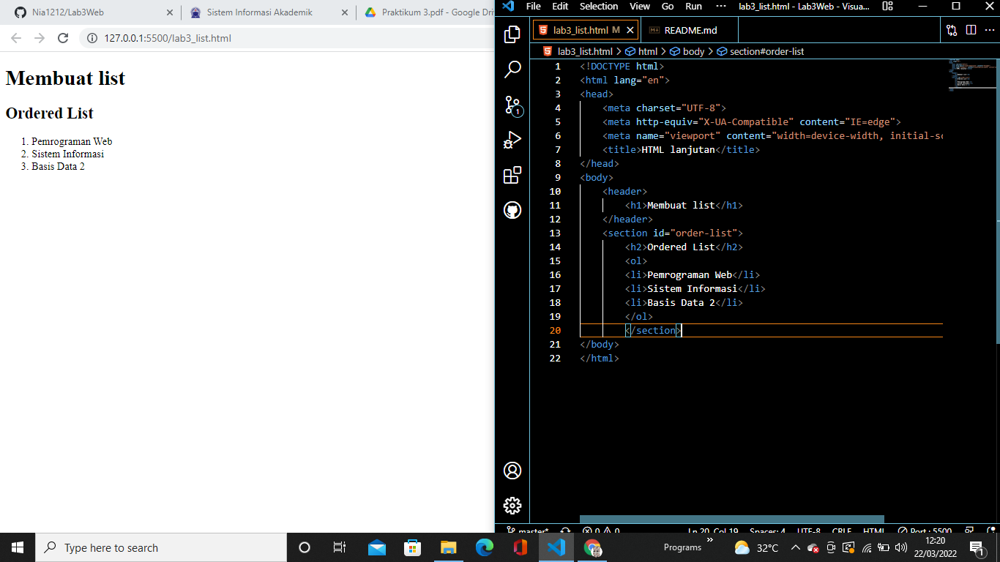
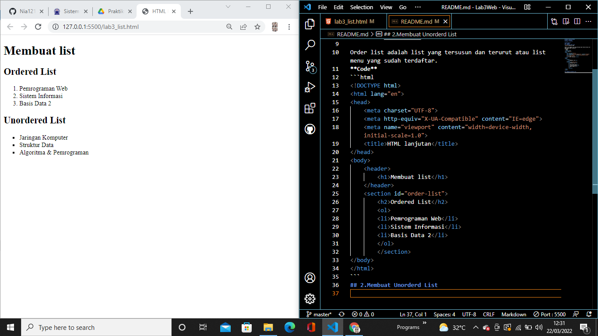
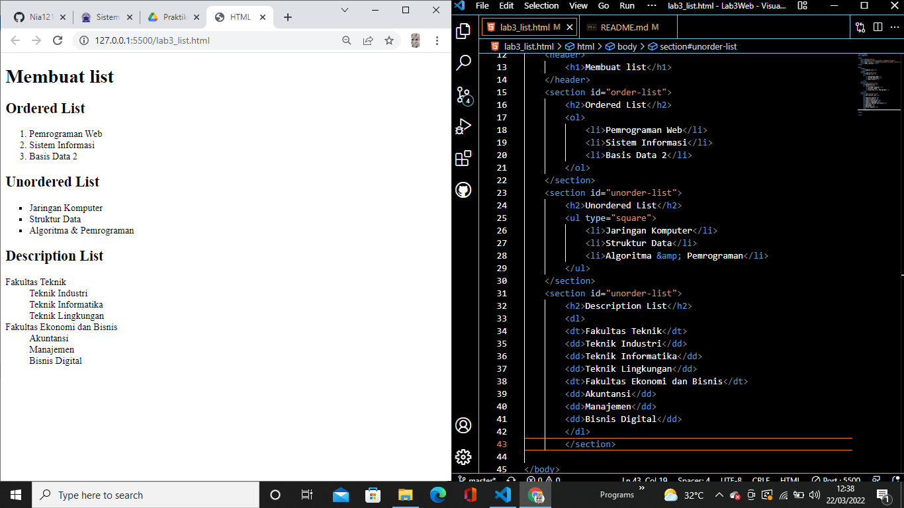
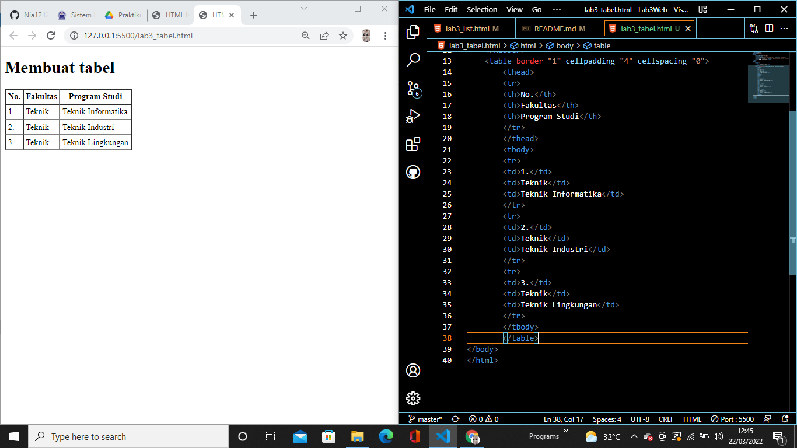
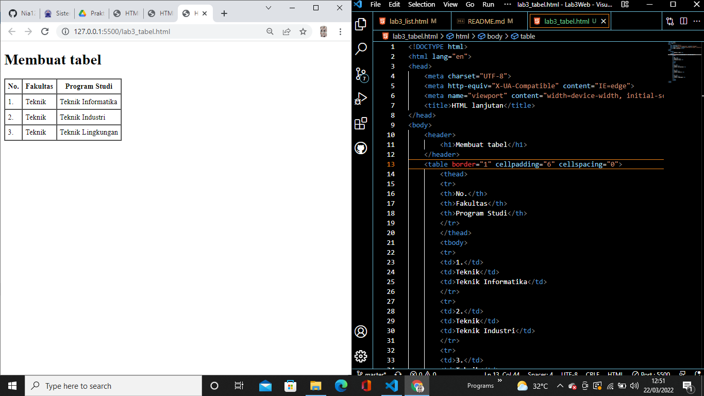
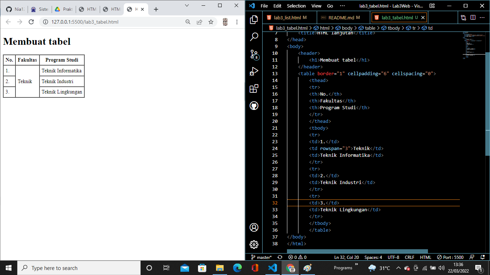
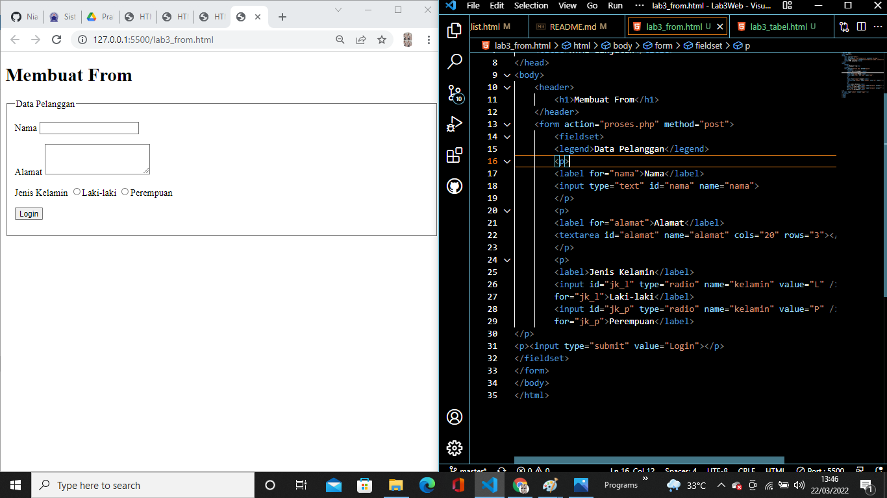
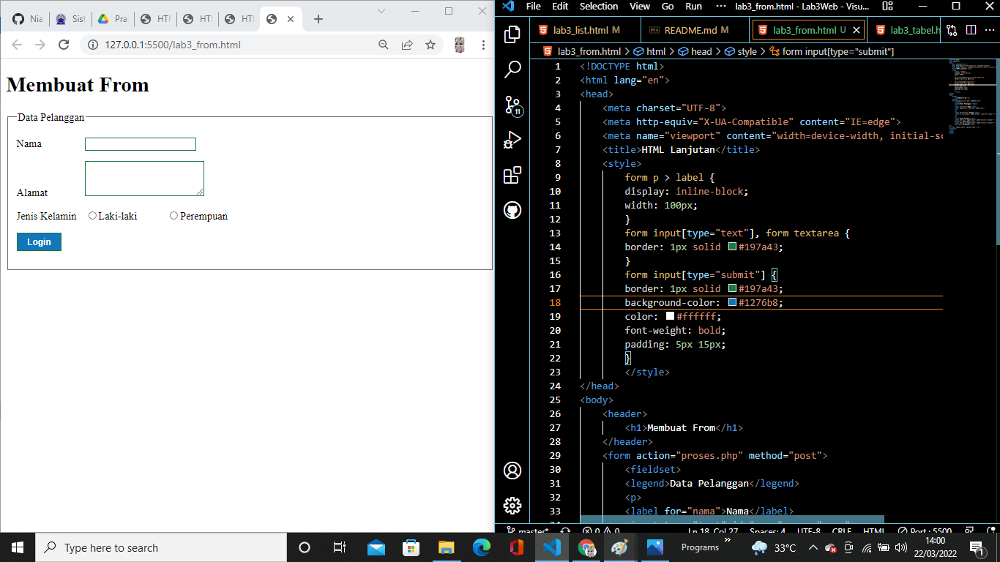

## Nama: Nia Dwi Rahayu
## Nim: 312010298
## Kelas: TI.20.A2

## Pertemuan 4 
## Lab3Web
## 1.Membuat order list


Order list adalah list yang tersusun dan terurut atau list menu yang sudah terdaftar.
**Code**
```html
<!DOCTYPE html>
<html lang="en">
<head>
    <meta charset="UTF-8">
    <meta http-equiv="X-UA-Compatible" content="IE=edge">
    <meta name="viewport" content="width=device-width, initial-scale=1.0">
    <title>HTML lanjutan</title>
</head>
<body>
    <header>
        <h1>Membuat list</h1>
    </header>
    <section id="order-list">
        <h2>Ordered List</h2>
        <ol>
        <li>Pemrograman Web</li>
        <li>Sistem Informasi</li>
        <li>Basis Data 2</li>
        </ol>
        </section>
</body>
</html>
```
## 2.Membuat Unorderd List


Unorderd list adalah list yang tidak terurut atau list acak seperti contoh gambar diatas.

**Code**
```html
<section id="unorder-list">
        <h2>Unordered List</h2>
        <ul type="square">
            <li>Jaringan Komputer</li>
            <li>Struktur Data</li>
            <li>Algoritma &amp; Pemrograman</li>
        </ul>
    </section>
```

## 3.Membuat Description List


Membuat Description List adalah dl sebagai memuat konten dt sebagai konten istilah antara penjelasannya ada di dd.

**Code**
```html
<section id="unorder-list">
        <h2>Description List</h2>
        <dl>
        <dt>Fakultas Teknik</dt>
        <dd>Teknik Industri</dd>
        <dd>Teknik Informatika</dd>
        <dd>Teknik Lingkungan</dd>
        <dt>Fakultas Ekonomi dan Bisnis</dt>
        <dd>Akuntansi</dd>
        <dd>Manajemen</dd>
        <dd>Bisnis Digital</dd>
        </dl>
        </section>
```

## 4.Membuat tabel


Tabel memiliki struktur code thead dan th sebagai tabel head kemudian ada tr sebagai tabel row dan juga td sebagai tabel data atau isi.

**Code**
```html
<!DOCTYPE html>
<html lang="en">
<head>
    <meta charset="UTF-8">
    <meta http-equiv="X-UA-Compatible" content="IE=edge">
    <meta name="viewport" content="width=device-width, initial-scale=1.0">
    <title>HTML lanjutan</title>
</head>
<body>
    <header>
        <h1>Membuat tabel</h1>
    </header>
    <table border="1" cellpadding="4" cellspacing="0">
        <thead>
        <tr>
        <th>No.</th>
        <th>Fakultas</th>
        <th>Program Studi</th>
        </tr>
        </thead>
        <tbody>
        <tr>
        <td>1.</td>
        <td>Teknik</td>
        <td>Teknik Informatika</td>
        </tr>
        <tr>
        <td>2.</td>
        <td>Teknik</td>
        <td>Teknik Industri</td>
        </tr>
        <tr>
        <td>3.</td>
        <td>Teknik</td>
        <td>Teknik Lingkungan</td>
        </tr>
        </tbody>
        </table>
</body>
</html>
```

## 5.Mengatur Margin dan Padding


Disitu saya menambahkan cellpadding 6 yang sebelumnya 4.

**Code**
```html
 <table border="1" cellpadding="6" cellspacing="0">
```

## 6.Menggabungkan Sel Data


Untuk menggabungkan sel data, gunakan atribut rowspan dan colspan. Atribut rowspan untuk
menggabungkan baris (secara vertikal) dan colspan untuk menggabungkan kolom (secara
horizontal).

**Code**
```html
<table border="1" cellpadding="6" cellspacing="0">
        <thead>
        <tr>
        <th>No.</th>
        <th>Fakultas</th>
        <th>Program Studi</th>
        </tr>
        </thead>
        <tbody>
        <tr>
        <td>1.</td>
        <td rowspan="3">Teknik</td>
        <td>Teknik Informatika</td>
        </tr>
        <tr>
        <td>2.</td>
        <td>Teknik Industri</td>
        </tr>
        <tr>
        <td>3.</td>
        <td>Teknik Lingkungan</td>
        </tr>
        </tbody>
```

## 7.Membuat From


Dalam membuat from pertama menggunakan kode from kemudian dibungkus fieldset dan kemudian label dan pilih tipe input sesuai kebutuhan from.

**Code**
```html
<!DOCTYPE html>
<html lang="en">
<head>
    <meta charset="UTF-8">
    <meta http-equiv="X-UA-Compatible" content="IE=edge">
    <meta name="viewport" content="width=device-width, initial-scale=1.0">
    <title>HTML Lanjutan</title>
</head>
<body>
    <header>
        <h1>Membuat From</h1>
    </header>
    <form action="proses.php" method="post">
        <fieldset>
        <legend>Data Pelanggan</legend>
        <p>
        <label for="nama">Nama</label>
        <input type="text" id="nama" name="nama">
        </p>
        <p>
        <label for="alamat">Alamat</label>
        <textarea id="alamat" name="alamat" cols="20" rows="3"></textarea>
        </p>
        <p>
        <label>Jenis Kelamin</label>
        <input id="jk_l" type="radio" name="kelamin" value="L" /><label
        for="jk_l">Laki-laki</label>
        <input id="jk_p" type="radio" name="kelamin" value="P" /><label
        for="jk_p">Perempuan</label>
</p>
<p><input type="submit" value="Login"></p>
</fieldset>
</form>
</body>
</html>
```

## 8.Menambahkan Style pada Form


Menambahkan Css internal pada from.

**Code**
```html
<style>
        form p > label {
        display: inline-block;
        width: 100px;
        }
        form input[type="text"], form textarea {
        border: 1px solid #197a43;
        }
        form input[type="submit"] {
        border: 1px solid #197a43;
        background-color: #1276b8;
        color: #ffffff;
        font-weight: bold;
        padding: 5px 15px;
        }
        </style>
```